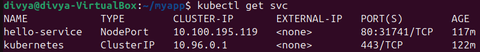
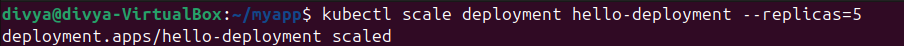
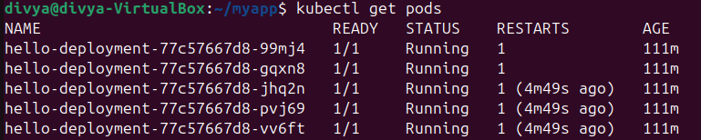
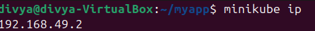
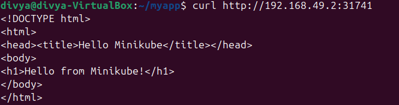

Kubernetes Minikube Cluster Project

📌 Objective  
Deploy and manage applications in Kubernetes using Minikube, `kubectl`, and Docker.  

🛠 Tools Used  
- **Minikube** – Local Kubernetes cluster  
- **kubectl** – Kubernetes CLI tool  
- **Docker** – For containerizing the app  

📂 Project Structure  
    ├── .gitignore
    ├── Dockerfile
    ├── deployment.yaml
    ├── index.html
    ├── service.yaml
    └── screenshots/
    ├── kubectl_get_pods.png
    ├── kubectl_get_svc.png
    ├── kubectl_scale_deployment.png
    ├── kubectl_get_pods_after_scale.png
    ├── minikube_ip.png
    └── curl_minikube_app.png

                       
🚀 Steps to Run the Project

1️⃣ Install & Start Minikube
  
    minikube start

2️⃣ Create Deployment

    kubectl apply -f deployment.yaml

3️⃣ Create Service (NodePort)

    kubectl apply -f service.yaml

4️⃣ Verify Pods and Services

    kubectl get pods
    kubectl get svc

5️⃣ Scale the Deployment

    kubectl scale deployment hello-deployment --replicas=5

6️⃣ Access the Application

    Get the Minikube IP:
    minikube ip

Access using NodePort from service.yaml:
     curl http://`<minikube-ip>`:`<nodeport>`

📸 Screenshots  
  
  🔹 Services  
      
    *Output of `kubectl get svc` showing ClusterIP and NodePort services.*  

  🔹 Scale Deployment Command  
      
    *Command used to scale deployment replicas to 5.*  

  🔹 Pods After Scaling  
      
    *Output of `kubectl get pods` after scaling, showing multiple replicas.*  

  🔹 Minikube IP  
      
    *Command `minikube ip` showing the IP address of the Minikube cluster.*  

  🔹 App Output in Curl  
      
    *Output of curl request to the NodePort service showing "Hello from Minikube!".*  

